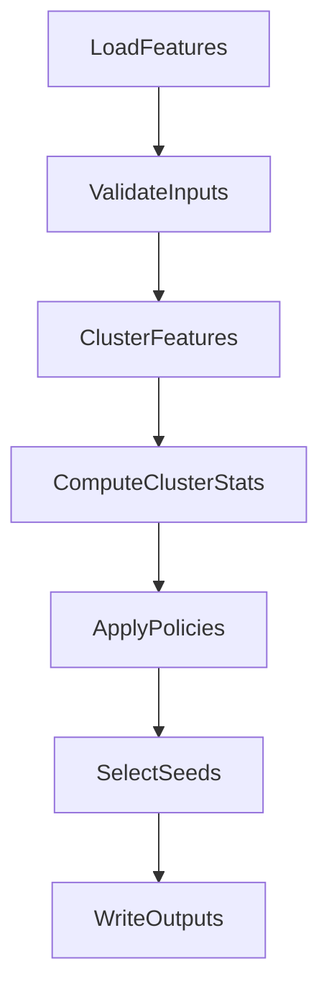

# Python API

AdaptivePy exposes a high-level function for programmatic use.

## `run_adaptive_sampling`

```python
from adaptivepy import run_adaptive_sampling

results = run_adaptive_sampling("config.yaml")
```

Returns a dictionary mapping **policy name** to a list of `SeedResult` objects:

```python
for policy_name, seeds in results.items():
    print(f"{policy_name}: {len(seeds)} seeds")
    for seed in seeds:
        print(f"  traj={seed.traj_id} frame={seed.frame_id} cluster={seed.cluster_id}")
```

## Pre-parsed configuration

Pass a pre-loaded `RunConfig` to skip re-reading the YAML file:

```python
from adaptivepy import run_adaptive_sampling
from adaptivepy.config import load_config

config = load_config("config.yaml")
results = run_adaptive_sampling("config.yaml", config=config)
```

## Validation only

```python
from adaptivepy.api import validate_config

config = validate_config("config.yaml")
print(config.features_dir, config.policies, config.policy_params)
```

Goal-oriented policies (`fast`, `ma_reap`) read settings from `config.policy_params`.
See [Configuration](configuration.md#policy-parameters) and [Policies](policies.md).

## Workflow overview



## See also

- [API Reference: Public API](reference/api.md) — full docstrings for `run_adaptive_sampling` and `validate_config`
- [Configuration](configuration.md) — YAML options
- [Outputs](outputs.md) — result file formats
